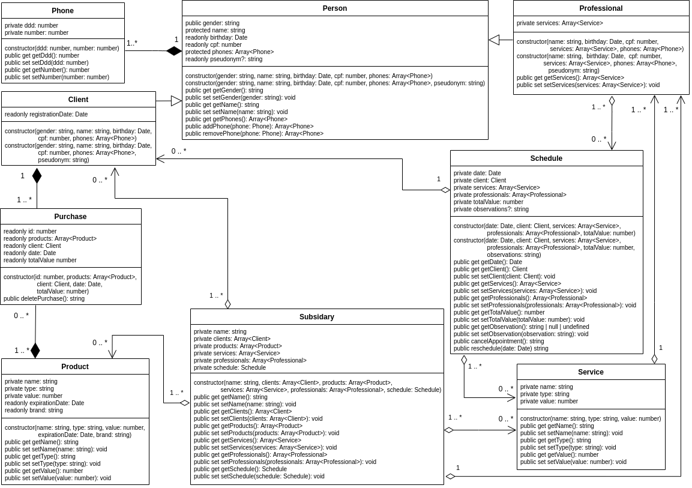

<h1 align="center">
  Atividade 01 - TPI I
</h1>

<p align="center">
  <a href="#projeto">Sobre o projeto</a>&nbsp;&nbsp;&nbsp;|&nbsp;&nbsp;&nbsp;
  <a href="#requisitos">Como rodar</a>&nbsp;&nbsp;&nbsp;|&nbsp;&nbsp;&nbsp;
  <a href="#demo">Demonstração</a>
</p>

<span id="projeto">
  
# :bookmark_tabs: Sobre o projeto
Este é um sistema para gerenciamento de um ambiente comercial, especificamente um salão de beleza, consistindo em uma série de opções acessadas via terminal que permitem cadastro, exclusão e alteração de informações sobre clientes, produtos, serviços e pedidos, além de possibilitar também a aplicação de alguns filtros para obter dados como "quais os clientes que mais consumiram em quantidade" ou "qual o produto mais consumido". Este projeto foi construído utilizando Typescript, com foco na prática dos conceitos de POO.
- Abaixo é possível observar o Diagrama de Classes desenvolvido para essa atividade, onde é possível encontrar as classes para clientes, telefones, profissionais (um plus ainda não implementado que visa o controle dos funcionários do salão) assim como a agenda do salão e os pedidos (encarados como a compra de algum produto ou contratação de algum serviço disponibilizado).

<p align="center">
  
</p>

## :railway_track: Opções disponibilizadas para gerenciamento

|                   | Clientes           | Produtos           | Serviços           | Pedidos            |
| :---------------- | :----------------- | :----------------- | :----------------- | :----------------- |
| Cadastro          | :heavy_check_mark: | :heavy_check_mark: | :heavy_check_mark: | :heavy_check_mark: |
| Alteração         | :heavy_check_mark: | :heavy_check_mark: | :heavy_check_mark: | :x:                |
| Exclusão          | :heavy_check_mark: | :heavy_check_mark: | :heavy_check_mark: | :heavy_check_mark: |
| Listagem geral    | :heavy_check_mark: | :heavy_check_mark: | :heavy_check_mark: | :heavy_check_mark: |
| Listagem filtrada | :x:                | :x:                | :x:                | :x:                |

<span id="requisitos">

# :gear: Como rodar

Antes de executar o projeto é necessário ter instalado o Node.js e o Git. Após a instalação, siga este passo a passo:

```bash
# Clone esse repositório
$ git clone https://github.com/MariaGabrielaReis/TPI-test.git

# Instale as dependências do projeto, assim como suas tipagens
$ npm install

# Compile a aplicação
$ tsc

# Execute a aplicação
$ node out/main.js

# O projeto inciará via terminal
```

<span id="demo">
  
# :desktop_computer: Demonstração
Para efeito de produtividade, foram criados cadastros padrão, para facilitar a manipulação e demonstração das funcionalidades que se encontram a seguir.

#### Clientes: cadastro, alteração, listagem geral e exclusão

<p align="center">
  
</p>

#### Produtos: cadastro, alteração, listagem geral e exclusão

<p align="center">
  
</p>

#### Serviços: cadastro, alteração, listagem geral e exclusão

<p align="center">
  
</p>

#### Pedidos: cadastro, listagem geral e exclusão

<p align="center">
  
</p>

[](https://www.linkedin.com/in/mariagabrielareis/)
